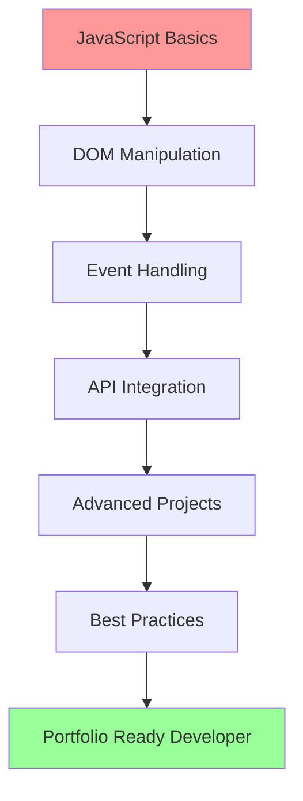

# 🚀 ZeroToJS - JavaScript Mastery Journey

<div align="center">

  
 
    
     
     
     
      
[](https://github.com/ritikkumar8z/ZeroToJS/stargazers)  
[](https://github.com/ritikkumar8z/ZeroToJS/network/members)
[](https://github.com/ritikkumar8z/ZeroToJS/issues) 
[](https://github.com/ritikkumar8z/ZeroToJS/pulls)
 
**Transform from Zero to JavaScript Hero through hands-on practice and real-world projects**
 
[📚 Start Learning](#-course-structure) • [🛠️ Quick Setup](#-quick-start) • [🌟 Projects](#-featured-projects) • [💬 Community](#-community)

</div>

---

## 🎯 Mission Statement

> **"Practice beats theory, projects beat tutorials."**

ZeroToJS isn't just another JavaScript course — it's a comprehensive, project-driven journey that transforms complete beginners into confident JavaScript developers. Every concept is learned through building real applications, ensuring you gain practical skills that directly translate to professional development.

## ✨ What Makes This Different?

<table>
<tr>
<td width="33%" align="center">
<h3>🔥 100% Hands-On</h3>
No boring theory sessions.<br>
Every concept learned through building real projects.
</td>
<td width="33%" align="center">
<h3>🎯 Industry-Ready</h3>
Projects mirror real-world scenarios<br>
you'll encounter as a developer.
</td>
<td width="33%" align="center">
<h3>📈 Progressive Learning</h3>
Carefully structured path from<br>
complete beginner to advanced concepts.
</td>
</tr>
</table>

## 🎓 Learning Outcomes

By completing ZeroToJS, you will master:

### 🔨 **Core JavaScript Fundamentals**
- Variables, Data Types & Operators
- Control Flow (Conditionals & Loops)
- Functions & Scope Management
- Objects & Arrays Deep Dive
- Error Handling & Debugging

### 🌐 **Modern JavaScript (ES6+)**
- Arrow Functions & Template Literals
- Destructuring & Spread Operator
- Promises, Async/Await & Fetch API
- Classes & Modules
- Map, Set & Advanced Array Methods

### 🎨 **DOM Manipulation & Events**
- Dynamic Content Management
- Event Handling & Delegation
- Form Validation & Processing
- Local Storage Integration
- Responsive UI Development

### 🔗 **API Integration & Async Programming**
- RESTful API Communication
- JSON Data Handling
- Error Handling for Network Requests
- Authentication Basics
- Third-party Service Integration

## 📊 Course Structure

```
📦 ZeroToJS/
├── 📁 01_fundamentals/           # Core JavaScript concepts
│   ├── variables-datatypes/
│   ├── functions-scope/
│   ├── objects-arrays/
│   └── control-flow/
├── 📁 02_dom_mastery/           # DOM manipulation projects
│   ├── calculator/
│   ├── todo-list/
│   ├── form-validator/
│   └── digital-clock/
├── 📁 03_api_integration/       # API-based applications
│   ├── weather-app/
│   ├── quote-generator/
│   ├── news-reader/
│   └── movie-database/
├── 📁 04_advanced_projects/     # Complex applications
│   ├── expense-tracker/
│   ├── music-player/
│   ├── e-commerce-cart/
│   └── portfolio-website/
└── 📁 05_bonus_content/         # Extra challenges
    ├── algorithms/
    ├── design-patterns/
    └── performance-optimization/
```

## 🌟 Featured Projects

<details>
<summary><strong>🧮 Interactive Calculator</strong></summary>

**Skills Learned:** Event handling, Mathematical operations, UI feedback
- Advanced operator handling
- Keyboard support
- Memory functions
- Scientific calculator features

</details>

<details>
<summary><strong>📝 Smart Todo Application</strong></summary>

**Skills Learned:** Local storage, CRUD operations, Array methods
- Drag & drop functionality
- Categories and priorities
- Due date management
- Data persistence

</details>

<details>
<summary><strong>🌤️ Weather Dashboard</strong></summary>

**Skills Learned:** API integration, Async programming, Error handling
- Real-time weather data
- 7-day forecast
- Geolocation support
- Multiple city tracking

</details>

<details>
<summary><strong>💰 Expense Tracker</strong></summary>

**Skills Learned:** Data visualization, Chart libraries, Financial calculations
- Income/expense categorization
- Budget planning
- Data export functionality
- Visual reports and charts

</details>

<details>
<summary><strong>🎵 Music Player</strong></summary>

**Skills Learned:** Media APIs, Audio manipulation, Advanced UI
- Playlist management
- Audio visualizations
- Equalizer controls
- Offline storage

</details>

<details>
<summary><strong>🛒 E-commerce Product Page</strong></summary>

**Skills Learned:** Shopping cart logic, Payment integration, State management
- Product filtering & search
- Shopping cart functionality
- User authentication
- Payment gateway integration

</details>

## 🚀 Quick Start

### Prerequisites
- Basic computer literacy
- Text editor (VS Code recommended)
- Modern web browser
- Enthusiasm to learn! 🔥

### Installation

```bash
# Clone the repository
git clone https://github.com/ritikkumar8z/ZeroToJS.git

# Navigate to project directory
cd ZeroToJS

# Start with fundamentals
cd 01_fundamentals/variables-datatypes

# Open in browser
open index.html
```

### Development Setup

```bash
# Install Live Server (optional but recommended)
npm install -g live-server

# Start development server
live-server

# Or use VS Code Live Server extension
```

## 🎯 Who This Course Is For

<table>
<tr>
<td width="25%" align="center">
<h4>👶 Complete Beginners</h4>
Never written a line of code?<br>
Perfect starting point!
</td>
<td width="25%" align="center">
<h4>🎓 CS Students</h4>
Supplement your theoretical<br>
knowledge with practical skills
</td>
<td width="25%" align="center">
<h4>🔄 Career Switchers</h4>
Transitioning to web development?<br>
Build a solid foundation
</td>
<td width="25%" align="center">
<h4>💼 Interview Prep</h4>
Preparing for frontend interviews?<br>
Practice real coding challenges
</td>
</tr>
</table>

## 📈 Learning Path



## 💡 Key Features

### 🏗️ **Project-Based Learning**
Every concept is taught through building real applications. No theoretical fluff!

### 📱 **Responsive Design**
All projects are mobile-first and responsive, teaching modern web development practices.

### 🔧 **Modern JavaScript**
Focus on ES6+ features and modern development patterns used in the industry.

### 🎨 **Clean Code Principles**
Learn to write maintainable, readable, and scalable JavaScript code.

### 🚀 **Performance Optimization**
Understand how to write efficient JavaScript that performs well in production.

### 🧪 **Testing & Debugging**
Learn essential debugging techniques and testing strategies.

## 📚 Additional Resources

### 📖 **Recommended Reading**
- [MDN JavaScript Guide](https://developer.mozilla.org/en-US/docs/Web/JavaScript/Guide)
- [JavaScript.info](https://javascript.info/)
- [You Don't Know JS](https://github.com/getify/You-Dont-Know-JS)

### 🛠️ **Tools & Extensions**
- **VS Code Extensions:** JavaScript (ES6) code snippets, Prettier, ESLint
- **Browser DevTools:** Chrome DevTools, Firefox Developer Tools
- **Online Editors:** CodePen, JSFiddle, CodeSandbox

### 🎥 **Bonus Content**
- Video walkthroughs for complex projects
- Code review sessions
- Live coding streams
- Interview preparation materials

## 🤝 Contributing

We welcome contributions from the community! Here's how you can help:

### 🐛 **Report Issues**
Found a bug or have a suggestion? [Open an issue](https://github.com/ritikkumar8z/ZeroToJS/issues)

### 🔧 **Submit Pull Requests**
```bash
# Fork the repository
# Create a feature branch
git checkout -b feature/amazing-feature

# Make your changes
# Commit your changes
git commit -m "Add amazing feature"

# Push to the branch
git push origin feature/amazing-feature

# Open a Pull Request
```

### 📝 **Content Contributions**
- Add new projects
- Improve existing tutorials
- Create solution explanations
- Write documentation

## 📊 Progress Tracking

Track your learning journey:

- [ ] **Week 0-1:** JavaScript Fundamentals
- [ ] **Week 2-3:** DOM Manipulation Projects
- [ ] **Week 4-5:** API Integration
- [ ] **Week 6-8:** Advanced Projects
- [ ] **Week 9-10:** Portfolio Development
- [ ] **Week 10-12:** Interview Preparation

## 🌟 Success Stories

> *"ZeroToJS transformed my understanding of JavaScript. The project-based approach made everything click!"* - **Raushan Pandey., Data Scientist & ML Developer**

> *"Got my first developer job after completing this course. The projects in my portfolio were impressive to employers."* - **RK Singh., Software Engineer**

> *"Finally understood async JavaScript through the weather app project. Brilliant teaching method!"* - **Mijanur Rahaman., Software Developer**

## 📞 Support & Community

### 💬 **Get Help**
- 🐛 [Report Issues](https://github.com/ritikkumar8z/ZeroToJS/issues)
- 💡 [Feature Requests](https://github.com/ritikkumar8z/ZeroToJS/issues/new)
- 📧 Email: ritikkumarparsa45@gmail.com

### 🌐 **Connect**
- 📱 [Twitter](https://twitter.com/ritikkumar8z)
- 💼 [LinkedIn](https://linkedin.com/in/ritikkumar8z)
- 🌍 [Portfolio](https://ritikkumar8z.web.app)

---

## 👨‍💻 About the Creator

<div align="center">


### **Ritik Kumar**
*Full-Stack Developer & Educator*

</div>

Passionate about making programming accessible to everyone. With 5+ years in web development and a love for teaching, I've created ZeroToJS to bridge the gap between theory and practical skills.

**My Philosophy:** *"The best way to learn programming is by building things that matter."*

### 🏆 **Achievements**
- 🎓 Mentored 1000+ students in web development
- 🚀 Built 50+ production-ready applications
- 📚 Created educational content viewed by 100K+ developers
- 🌟 Open source contributor with 20+ repositories

### 💼 **Professional Experience & Education**
- **Senior Frontend Developer** at NextCoreAI(Jan 2025-Present)
- **Freelance Developer**at SimpleBy (May 2025- Aug 2025)
- **BCA** at Brainware University(2022-2025)


---

## 📜 License

This project is licensed under the MIT License - see the [LICENSE](LICENSE) file for details.

## ⭐ Show Your Support

If ZeroToJS helped you in your JavaScript journey, please consider:

- ⭐ **Starring this repository**
- 🐦 **Sharing on social media**
- 📝 **Writing a testimonial**
- 🤝 **Contributing to the project**

---

<div align="center">

**Ready to become a JavaScript Hero?** 🚀

[**🌟 Star this repo**](https://github.com/ritikkumar8z/ZeroToJS) • [**🔗 Start Learning Now**](https://github.com/ritikkumar8z/ZeroToJS/tree/main/01_fundamentals)

---

**Made with ❤️ by [Ritik Kumar](https://ritikkumar8z.web.app)**

*Empowering developers, one project at a time.*

</div>
